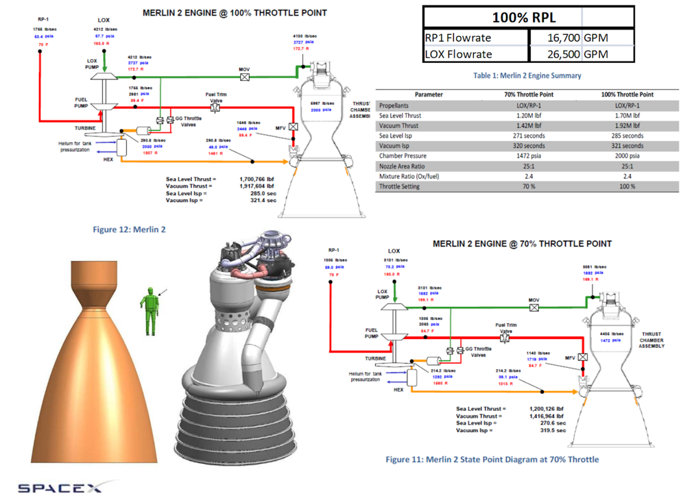
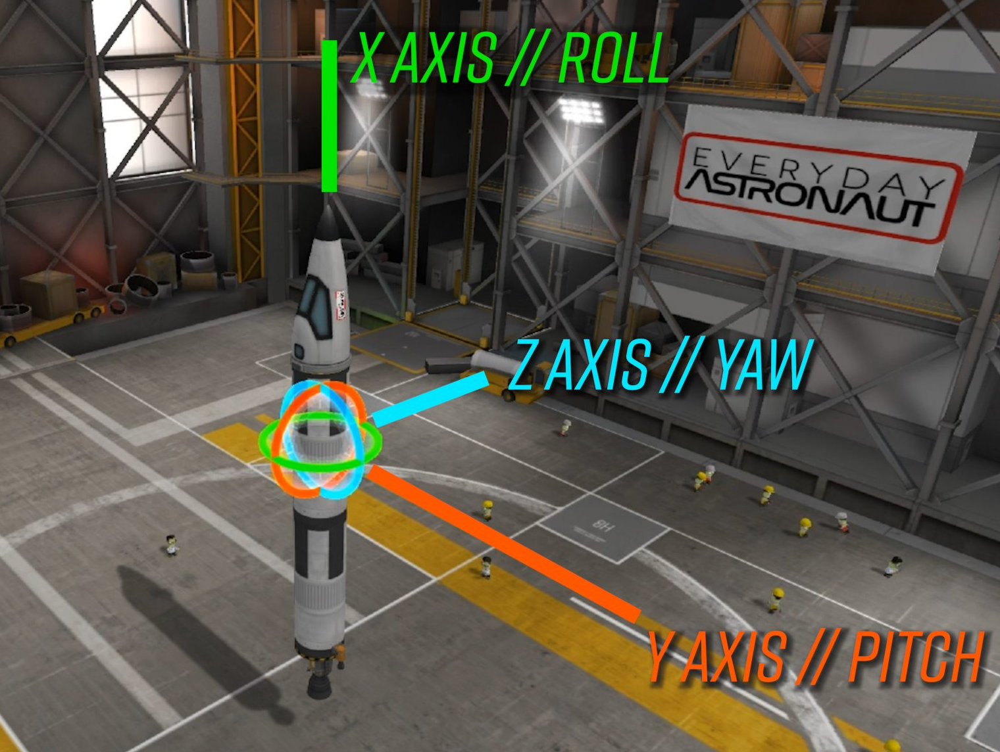
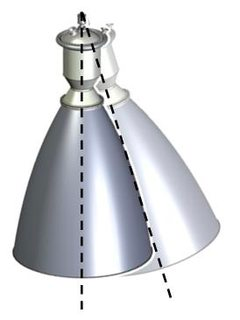
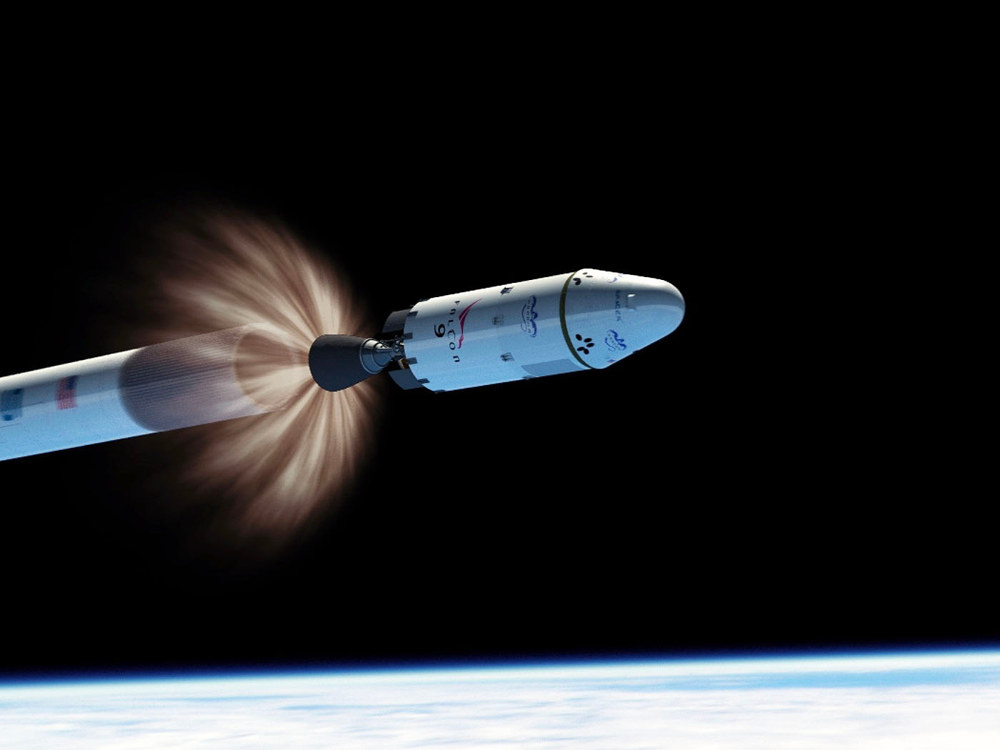

# Simulador SpaceX

El taller consiste en simular un cohete de SpaceX, en concreto un Falcon 9. Las físicas y controles de posición se han
simplificado y son ficticios siguiendo un poco la lógica.

Tendremos los siguientes micro servicios funcionando entre sí:

- **falcon9**: Este repositorio es el principal que dará órdenes y enviará información al resto de MS.
- **coldgasthusters**: Control del sistema de empuje mediante gas presurizado.
- **engine**: Control de los 8 motores Merlin
- **gimbal**: Control del sistema gimbal de los 8 motores Merlin
- **gps**: Control del sistema de posicionamiento
- **gridfins**: Control de las rejillas para estabilizar el cohete
- **kerosene**: Control del sistema de Keroseno
- **landinglegs**: Control de las 4 patas de aterrizaje
- **lox**: Control del sistema de Oxígeno líquido
- **payload**: Control de la carga que vamos a desplegar en el espacio
- **secondstage**: Control de la segunda fase del cohete, que se separa y contiene el payload
- **turbopump**: Control de la turbina y bombas para poder mezclar RP-1 y LOX

Controlaremos las diferentes fases de una misión del lanzamiento de un satélite starlink con un Falcon 9, como podemos
ver en la siguiente imagen:


## Installation

Para ejecutar en local: 

```bash
./gradlew build 
./gradlew bootRun 
```

## Fases de la misión

### 1.0 Check

Se trata de que todos los micro servicios respondan con un mensaje de Health Check, el micro servicio principal
(este proyecto) espera la siguiente respuesta:
```json
{
  "target": "Nombre micro servicio, por ejemplo 'engine'",
  "status": "Healthy"
}
```
---

### 2.0 Launch

Se trata de la fase de lanzamiento, y los micro servicios que entran en marcha son los siguientes:

#### 2.1 Engine - POST https://{api-url}/api/engine/launch

El motor tiene que primero presurizar la cámara a `2000` psia y poner él `Mode` en `FULL`, esto quiere decir que el 
atributo `throttle` hay que ajustarlo al 100%. 

**IMPORTANTE**: No se puede ajustar él `Mode` y `throttle` a la potencia
máxima si la cámara no se ha presurizado, tampoco podemos presurizar la cámara de golpe, cada `100 ms` debemos incrementar
`100 psia` hasta llegar al valor de `2000`. Quiere decir que tardará `2 segundos` en `incrementar la presión de 0 a 2000`.

Hay que tener en cuenta que tenemos 8 motores en comunicación con el cohete, en la parte de simulación con el Hardware
del cohete tendremos una interfaz controlando 8 motores.

La respuesta de este endpoint al finalizar los ajustes debe ser:
```json
{
  "engine": {
    "mode": "FULL",
    "throttle": 1,
    "chamberPressure": 2000
  }
}
```

#### 2.2 Kerosene Control - POST https://{api-url}/api/kerosene/launch

El control de Keroseno primero de todo debe activar la `mainValve` y seguidamente comenzar a bombear hasta llegar a 
`fuelPumpPercentage` del 100 % con el valor `1`, donde él `flowRate` irá incrementando hasta `801 kg/s` de combustible al 100%.

**IMPORTANTE**: No se puede ajustar él `fuelPumpPercentage` si la `mainValve` no está abierta. También debemos incrementar
la potencia de bombeo `40 kg/s` cada `100 ms`.

La respuesta de este endpoint al finalizar los ajustes debe ser:
```json
{
  "kerosene": {
    "mainValve": true,
    "ratio": 2.4,
    "fuelPumpPercentage": 1,
    "flowRate": 801
  }
}
```

#### 2.3 LOX Control - POST https://{api-url}/api/lox/launch

El control de oxígeno líquido primero de todo debe activar la `mainValve` y seguidamente comenzar a bombear hasta llegar a
`fuelPumpPercentage` del 100 % con el valor `1`, donde él `flowRate` irá incrementando hasta `1919 kg/s` de combustible al 100%.

**IMPORTANTE**: No se puede ajustar él `loxPumpPercentage` si la `mainValve` no está abierta. También debemos incrementar
la potencia de bombeo `95 kg/s` cada `100 ms`.

La respuesta de este endpoint al finalizar los ajustes debe ser:
```json
{
  "lox": {
    "mainValve": true,
    "ratio": 2.4,
    "loxPumpPercentage": 1,
    "flowRate": 1919
  }
}
```


#### 2.4 Turbo Pump - POST https://{api-url}/api/turbopump/launch

Para el funcionamiento del `Kerosene` y él `LOX` tenemos una turbina y dos bombas conectadas que son las que bombean los
diferentes combustibles. Esta bomba pone en marcha una turbina con él `throttle` al 100% donde las `rpm` irán incrementando
hasta `36000 rpm` con un resultado total de `hp` de `10000 hp`. Las `rpm` irán incrementando `1800 rpm` cada `100 ms`.

**IMPORTANTE**: Del JSON recibido deberemos comprobar que él `ratio` tanto del `lox` cómo `kerosene` corresponden 
con los `flowRate` del kerosene y lox, la fórmula es la siguiente: `lox flowRate` / `kerosene flowRate` = `ratio`, con 
un margen de error de un 5%.

La respuesta de este endpoint al finalizar los ajustes debe ser:
```json
{
  "turbopump": {
    "throttle": 1,
    "rpm": 36000,
    "hp": 10000
  }
}
```



---

### 3.0 Ascent

En la fase de ascenso entran en marcha el GPS, INS y Gimbal.

#### 3.1 GPS - POST https://{api-url}/api/gps/ascent

El GPS recibirá las coordenadas destino y se sitúa en las siguientes coordenadas:

##### Coordenadas actuales (las simulamos): 
    **Latitude**	28.573469
    **Longitude**	-80.651070

##### Coordenadas de aterrizaje:
    **Latitude** 28.775245058791235
    **Longitude** -77.38535548520339

Se deben de hacer check que las coordenadas de destino están a menos de 350 km de radio.


#### 3.2 Gimbal - POST https://{api-url}/api/gimbal/ascent

Primero de todo, antes de implementar este micro servicio hay que entender que es `X Y Z` o `Roll, Pitch, Yaw` para el
control de orientación de un cohete (ver imagen).



Para este endpoint usaremos `**Yaw** para corregir Latitude` y `**Pitch** para corregir Longitud`.
El Gimbal debe funcionar de la siguiente manera, por cada diferencia entre coordenadas actuales y de aterrizaje se deberá
aumentar `1º`, por ejemplo `Longitude -80.651070 y -77.38535548520339` el resultado será un `Yaw` de `3,26º`, en cambio
a la inversa `Longitude -77.38535548520339 y -80.651070` el resultado será un `Yaw` de `-3,26º`

**IMPORTANTE**: Se debe controlar que los 3 atributos no pueden pasar de los 20º, ya que es el giro máximo del motor en
toda su circumferencia, en X Y Z tanto positivo como negativo.



Hay que tener en cuenta que tenemos 8 motores, por lo tanto 8 Gimbal en comunicación con el cohete (todos actúan en la
misma posición a la vez).


La respuesta de este endpoint al finalizar los ajustes debe ser:
```json
{
  "gimbal": {
    "roll": 0,
    "pitch": 0,
    "yaw": 3.26
  }
}
```

---

### 4.0 Stage separation



#### 4.1 Engine - POST https://{api-url}/api/engine/stage-separation

El motor tiene que primero despresurizar la cámara a `0` psia y poner él `Mode` en `OFF`, esto quiere decir que el
atributo `throttle` hay que ajustarlo al 0%. Se puede realizar directamente.

#### 4.2 Second Stage - POST https://{api-url}/api/second-stage/stage-separation

Debemos desacoplar la `Second Stage` del `Falcon 9` activando `enableSeparation` a true e informando al cohete. El `throttle`
debe incrementar hasta él `100%` en `2000 ms`, pasados `3000 ms` después de activar `enableSeparation`.

https://www.youtube.com/watch?v=Vpsfy4npMhY

**IMPORTANTE**: Del JSON que recibe se debe controlar que en el `engine` su atributo `mode` este `OFF` y 
`throttle` al `0`.

---

### 5.0 Flip maneuver

Esta etapa se realiza seguida de la `Stage Separation` por eso los controles anteriores, ya que la maniobra de 
giro del cohete debe estar sincronizada después para que no choque con él `Falcon 9`.

#### 5.1 Cold Gas Thrusters - POST https://{api-url}/api/cold-gas-thrusters/flip-maneuver

Se activará él `ColdGasThruster` `right` durante `13000 ms` y luego para compensar la maniobra él `ColdGasThruster` `left`
`1000 ms`.

La respuesta de este endpoint al finalizar los ajustes debe ser:

```json
{
  "coldgasthusters": [
    {
      "right": {
        "thrust": 1,
        "secondsOfThrust": 13
      },
      "left": {
        "thrust": 1,
        "secondsOfThrust": 1
      }
    }
  ]
}

```
**IMPORTANTE**: Del JSON que recibe se debe controlar que en el `engine` su atributo `mode` este `OFF` y
`throttle` al `0`.


#### 5.2 Gimbal - POST https://{api-url}/api/gimbal/flip-maneuver

Reset de del Gimbal del `roll`, `pitch` y `yaw` a `0º`.

La respuesta de este endpoint al finalizar los ajustes debe ser:
```json
{
  "gimbal": {
    "roll": 0,
    "pitch": 0,
    "yaw": 0
  }
}
```
---

### 6.0 Boost back burn

#### 6.1 Engine - POST https://{api-url}/api/engine/boost-back-burn

El motor tiene que primero presurizar la cámara a `1472` psia y poner él `Mode` en `LIGHT`, esto quiere decir que el
atributo `throttle` hay que ajustarlo al 70%.

**IMPORTANTE**: No se puede ajustar él `Mode` y `throttle` a la potencia
indicada si la cámara no se ha presurizado, tampoco podemos presurizar la cámara de golpe, cada `100 ms` debemos incrementar
`300 psia` hasta llegar al valor de `1472`. Quiere decir que tardará unos `500 ms` en `incrementar la presión de 0 a 1472`.

Hay que tener en cuenta que tenemos 8 motores en comunicación con el cohete, en la parte de simulación con el Hardware
del cohete tendremos una interfaz controlando 8 motores.

La respuesta de este endpoint al finalizar los ajustes debe ser:
```json
{
  "engine": {
    "mode": "FULL",
    "throttle": 0.7,
    "chamberPressure": 1472
  }
}
```

#### 6.2 Kerosene Control - POST https://{api-url}/api/kerosene/boost-back-burn

El control de Keroseno primero de todo debe activar la `mainValve` y seguidamente comenzar a bombear hasta llegar a
`fuelPumpPercentage` del 70 % con el valor `0.7`, donde él `flowRate` irá incrementando hasta `560 kg/s` de combustible al 100%.

**IMPORTANTE**: No se puede ajustar él `fuelPumpPercentage` si la `mainValve` no está abierta. También debemos incrementar
la potencia de bombeo `40 kg/s` cada `100 ms`.

La respuesta de este endpoint al finalizar los ajustes debe ser:
```json
{
  "kerosene": {
    "mainValve": true,
    "ratio": 2.4,
    "fuelPumpPercentage": 0.7,
    "flowRate": 560
  }
}
```

#### 6.3 LOX Control - POST https://{api-url}/api/lox/boost-back-burn

El control de oxígeno líquido primero de todo debe activar la `mainValve` y seguidamente comenzar a bombear hasta llegar a
`fuelPumpPercentage` del 70 % con el valor `0.7`, donde él `flowRate` irá incrementando hasta `1343 kg/s` de combustible al 70%.

**IMPORTANTE**: No se puede ajustar él `loxPumpPercentage` si la `mainValve` no está abierta. También debemos incrementar
la potencia de bombeo `95 kg/s` cada `100 ms`.

La respuesta de este endpoint al finalizar los ajustes debe ser:
```json
{
  "lox": {
    "mainValve": true,
    "ratio": 2.4,
    "loxPumpPercentage": 0.7,
    "flowRate": 1343
  }
}
```

#### 6.4 Turbo Pump - POST https://{api-url}/api/turbopump/boost-back-burn

Para el funcionamiento del `Kerosene` y él `LOX` tenemos una turbina y dos bombas conectadas que son las que bombean los
diferentes combustibles. Esta bomba pone en marcha una turbina con él `throttle` al 70% donde las `rpm` irán incrementando
hasta `25200 rpm` con un resultado total de `hp` de `7000 hp`. Las `rpm` irán incrementando `1800 rpm` cada `100 ms`.

**IMPORTANTE**: Del JSON recibido deberemos comprobar que él `ratio` tanto del `lox` cómo `kerosene` corresponden
con los `flowRate` del kerosene y lox, la fórmula es la siguiente: `lox flowRate` / `kerosene flowRate` = `ratio`, con
un margen de error de un 5%.

La respuesta de este endpoint al finalizar los ajustes debe ser:
```json
{
  "turbopump": {
    "throttle": 0.7,
    "rpm": 25200,
    "hp": 7000
  }
}
```

---

### 7.0 Grid fins deploy

#### 7.1 Grid fins - POST https://{api-url}/api/gridfins/gridfinsdeploy

En este endpoint se desplegarán las 4 Grid Fins, poniendo a `true` el atributo `deploy` en `ZMinus, ZPlus, YMinus e YPlus`,
donde `Z` hace referencia `Yaw` e `Y` a `Pitch`.

**IMPORTANTE**: Si la temperatura es mayor a `540` no se abrirán.

La respuesta de este endpoint al finalizar los ajustes debe ser:
```json
{
  "gridfins": [
    {
        "zminus": {
          "deploy": true,
          "temperature": 300,
          "upDown": 0,
          "leftRight": 0
        }
    },
    {
      "zplus": {
        "deploy": true,
        "temperature": 300,
        "upDown": 0,
        "leftRight": 0
      }
    },

    {
      "yminus": {
        "deploy": true,
        "temperature": 300,
        "upDown": 0,
        "leftRight": 0
      }
    },

    {
      "yplus": {
        "deploy": true,
        "temperature": 300,
        "upDown": 0,
        "leftRight": 0
      }
    }
  ]
}
```
---

### 8.0 Entry Burn


---

## Contributing

Pull requests are welcome. For major changes, please open an issue first
to discuss what you would like to change.

Please make sure to update tests as appropriate.

## License

[MIT](https://choosealicense.com/licenses/mit/)